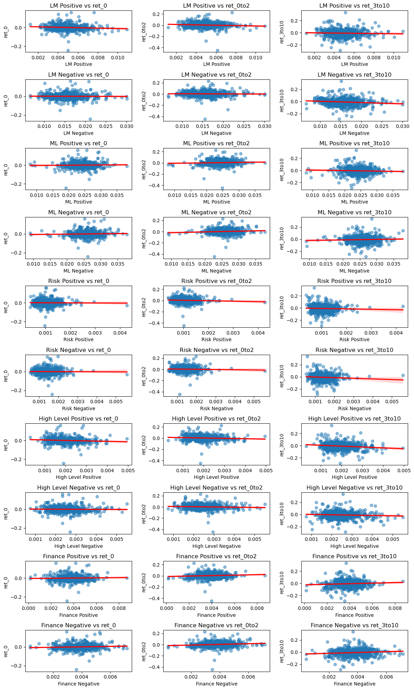
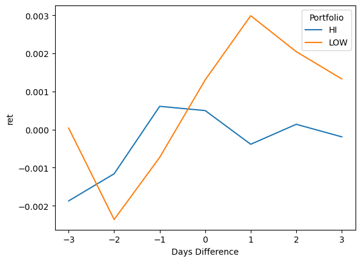

# **Study of Relationship Between 10k Sentiment and Returns - Jesse Coulter**

## Introduction

This study examines whether sentiment within public filings influences firm returns around filing dates and whether investors can leverage this information to make better investment decisions. To explore this, sentiment in multiple firms' 10-K filings was analyzed and compared to stock returns surrounding the filing date.

The findings did not reveal a consistent or significant relationship between sentiment and stock returns. While certain sentiment scores showed promising correlations that warrant further investigation, no definitive conclusions can be drawn at this time regarding the impact of sentiment on returns.

## Data

### Sample
The primary data sources for this project were 10k documents and firm stock returns. The 10k documents were scraped from the official SEC website, and then analyzed for sentiment. Stock returns for each firm were obtained from a preexisting file, and were compared against sentiment to find any relationships of value. It is important to note that only documents from firms in the S&P500 were scraped during the year 2022, making S&P500 2022 10ks and their corresponding firm returns the official sample for this project. 

### Return Variables
As said previously, the returns for each firm during 2022 were obtained from a preexisting file called crsp_2022_only.zip. This file contained the ticker of each company, the date in 2022, and the stock return during that date. For the project, cumulative returns needed to be calculated to get a better picture of the overall return of a stock during any given period. To do this, the following equation was utilized:

        Cumulative Return = [(1 + return(t)) * (1 + return(t+1)) * (1 + return(t+2)) * ... * (1 + return(t+end)) - 1]

By recreating this formula in python, I successfully calculated cumulative returns using:
```python
return_2022['period_return'] = (
     return_2022
     .assign(gross_ret = 1 + return_2022['period'])
     .groupby('ticker')['gross_ret']
     .transform('prod')-1
 )
```

For the purpose of this study, three return variables were calculated for each firm:
| Variable    | Description |
|----------------|--------|
| ret_0   | return on the filing date      | 
| ret_0to2  |   cumulative return between filing date and two days after   | 
| ret_3to10  | cumulative return between three and ten days after the filing      | 

To ensure the cumulative return was calculated correctly for the specific period, I set returns outside the target window to zero. This way, only the relevant days contributed to the cumulative return, preventing unintended compounding from out-of-period data. This approach ensures that the final cumulative return accurately reflects performance over the intended time frame. 


### Sentiment Variables

Ten sentiment variables were created to measure the sentiment in each 10k filing. The first four variables simply count how many words in the document are either of positive or negative sentiment. The last six variables focus on specific topics, such as climate change for example, and count how many sentimental words are near a word related to the chosen topic. To make the numbers comparable, the total number of hits for each variable is divided by the total number of words in each 10k to get a fraction. 

To do this, four lists of words were compiled that were either labeled as having positive or negative sentiment; two lists were positive and two lists were negative. These words were specifically compiled to correlate to the language within financial statements. 

The following table describes the four sentiment dictionaries that were used:

| Dictionary     | Length | Example Words         |
|----------------|--------|-----------------------|
| BHR_Negative_Words   | 94      | slowing, delays, due   |
| BHR_Positive_Words  |   75    | curious, success, pleased   |
| LM_Negative_Words   | 2345      | boycott, eroding, annulments  |
| LM_Positive_Words   | 347      | strongest, influential, perfects |

#### Basic Sentiment Analysis

Each of the first four variables corresponds to each of the four sentiment dictionaries used. Using one dictionary at a time, a hit occurred when a word in the 10k matched with a word in the dictionary. These hits were totaled up and divided by the total number of words to get the sentiment score. The following code shows how a variable is scored:

```python
 # 1. LM Positive
           pattern_1 = r'\b(' + '|'.join(LM_positive_words) + r')\b'
           LM_Positive = len(re.findall(pattern_1, cleaned_text))/words
           sp500.loc[index, 'LM Positive'] = LM_Positive
```

#### Contextual Sentiment Analysis

The last six variables are contextual sentiment measures, where three topics were selected and each given a positive and a negative sentiment score specific to that topic. For my project, I chose the following topics:

| Topic    | Length | Example Terms         |
|----------------|--------|-----------------------|
| Risk   | 28     | antitrust, litigation, liquidity  |
| High Level  |   10    | demand, market, competition   |
| Finance  | 13     | sales, profit, cash flow  |

These topics were chosen because I believe the combination of the three creates a well-rounded understanding of the 10k and the firm. When discussing financial data within the 10k, understanding the positive and negative sentiment can directly relate to how good the financial results are. Likewise, understanding the sentiment around high-level topics such as the overall market and competition is a tell of how the company is being affected by external factors. Lastly, understanding the risks to a business is critical to its success, so measuring sentiment about topics of risk is equally important.

To measure sentiment around these topics, a near_regex function was used. The purpose of the near_regex function is to identify words that relate to a specific topic and to scan around that word for words of sentiment. For example, the following example leads to one contextual sentiment hit:

```python
test = "The weather is bad, which has caused school delays."
def words_from_list(list):
    or_list =  "("+("|".join(list))+")"
    
    return or_list

words = [words_from_list(risk_list), words_from_list(BHR_negative_words)]
rgx = NEAR_regex(words, partial = True, max_words_between = 10)

print(len(re.findall(rgx,test)))
```
This code was then extended to measure contextual sentiment in 10k filings. Shown here:
```python
 # 5. Positive Risks
           risk_positive_words = [words_from_list(risk_list), words_from_list(BHR_positive_words)]
           risk_positive_rgx = NEAR_regex(risk_positive_words, partial = True, max_words_between = 5)
           risk_positive_hits = len(re.findall(risk_positive_rgx,cleaned_text))/words
           sp500.loc[index, 'Risk Positive'] = risk_positive_hits
```
By setting `partial = True` and `max_words_between = 5`, I told the regex to count hits where only part of a word is in the document and to look five words away from the topic word in either direction. With `max_words_between = 5`, I ensured I adequately covered an effective range around the topic word without capturing too many false hits. `partial = True` accounts for the case that words of sentiment or words about a topic might be made up of a word within the word saved in my lists. This setting ensures that words that are highly similar to what I am looking for are accounted for and can still lead to hits. 

### Final Analysis Sample Summary Stats


```python
import pandas as pd
output = pd.read_csv('output/analysis_sample.csv')
output.describe()
```


<div>
<style scoped>
    .dataframe tbody tr th:only-of-type {
        vertical-align: middle;
    }

    .dataframe tbody tr th {
        vertical-align: top;
    }

    .dataframe thead th {
        text-align: right;
    }
</style>
<table border="1" class="dataframe">
  <thead>
    <tr style="text-align: right;">
      <th></th>
      <th>CIK</th>
      <th># of Words</th>
      <th># of Unique Words</th>
      <th>LM Positive</th>
      <th>LM Negative</th>
      <th>ML Positive</th>
      <th>ML Negative</th>
      <th>Risk Positive</th>
      <th>Risk Negative</th>
      <th>High Level Positive</th>
      <th>High Level Negative</th>
      <th>Finance Positive</th>
      <th>Finance Negative</th>
      <th>ret_0</th>
      <th>ret_0to2</th>
      <th>ret_3to10</th>
    </tr>
  </thead>
  <tbody>
    <tr>
      <th>count</th>
      <td>5.030000e+02</td>
      <td>501.000000</td>
      <td>501.000000</td>
      <td>501.000000</td>
      <td>501.000000</td>
      <td>501.000000</td>
      <td>501.000000</td>
      <td>501.000000</td>
      <td>501.000000</td>
      <td>501.000000</td>
      <td>501.000000</td>
      <td>501.000000</td>
      <td>501.000000</td>
      <td>494.000000</td>
      <td>4.940000e+02</td>
      <td>494.000000</td>
    </tr>
    <tr>
      <th>mean</th>
      <td>7.919979e+05</td>
      <td>72447.049900</td>
      <td>4628.708583</td>
      <td>0.004960</td>
      <td>0.015742</td>
      <td>0.024100</td>
      <td>0.025690</td>
      <td>0.001088</td>
      <td>0.001430</td>
      <td>0.001986</td>
      <td>0.002493</td>
      <td>0.003789</td>
      <td>0.003771</td>
      <td>0.000906</td>
      <td>3.190608e-03</td>
      <td>-0.008682</td>
    </tr>
    <tr>
      <th>std</th>
      <td>5.522469e+05</td>
      <td>30107.995361</td>
      <td>715.504456</td>
      <td>0.001314</td>
      <td>0.003692</td>
      <td>0.003554</td>
      <td>0.003415</td>
      <td>0.000382</td>
      <td>0.000480</td>
      <td>0.000636</td>
      <td>0.000720</td>
      <td>0.001046</td>
      <td>0.000992</td>
      <td>0.034340</td>
      <td>5.204874e-02</td>
      <td>0.064406</td>
    </tr>
    <tr>
      <th>min</th>
      <td>1.800000e+03</td>
      <td>10040.000000</td>
      <td>1393.000000</td>
      <td>0.001195</td>
      <td>0.006629</td>
      <td>0.008019</td>
      <td>0.009088</td>
      <td>0.000384</td>
      <td>0.000523</td>
      <td>0.000299</td>
      <td>0.000748</td>
      <td>0.000157</td>
      <td>0.000392</td>
      <td>-0.242779</td>
      <td>-4.474992e-01</td>
      <td>-0.288483</td>
    </tr>
    <tr>
      <th>25%</th>
      <td>9.761050e+04</td>
      <td>53447.000000</td>
      <td>4208.000000</td>
      <td>0.004116</td>
      <td>0.013105</td>
      <td>0.021947</td>
      <td>0.023812</td>
      <td>0.000825</td>
      <td>0.001105</td>
      <td>0.001536</td>
      <td>0.002022</td>
      <td>0.003143</td>
      <td>0.003166</td>
      <td>-0.016478</td>
      <td>-2.555365e-02</td>
      <td>-0.048270</td>
    </tr>
    <tr>
      <th>50%</th>
      <td>8.848870e+05</td>
      <td>66944.000000</td>
      <td>4585.000000</td>
      <td>0.004859</td>
      <td>0.015575</td>
      <td>0.024256</td>
      <td>0.025682</td>
      <td>0.001048</td>
      <td>0.001374</td>
      <td>0.001892</td>
      <td>0.002379</td>
      <td>0.003748</td>
      <td>0.003753</td>
      <td>-0.001360</td>
      <td>6.180319e-10</td>
      <td>-0.010736</td>
    </tr>
    <tr>
      <th>75%</th>
      <td>1.137782e+06</td>
      <td>82568.000000</td>
      <td>5034.000000</td>
      <td>0.005631</td>
      <td>0.017667</td>
      <td>0.026207</td>
      <td>0.027640</td>
      <td>0.001275</td>
      <td>0.001669</td>
      <td>0.002337</td>
      <td>0.002910</td>
      <td>0.004434</td>
      <td>0.004419</td>
      <td>0.016286</td>
      <td>2.830900e-02</td>
      <td>0.028006</td>
    </tr>
    <tr>
      <th>max</th>
      <td>1.868275e+06</td>
      <td>278889.000000</td>
      <td>7991.000000</td>
      <td>0.010941</td>
      <td>0.030123</td>
      <td>0.038135</td>
      <td>0.037797</td>
      <td>0.004287</td>
      <td>0.005587</td>
      <td>0.004960</td>
      <td>0.005516</td>
      <td>0.008718</td>
      <td>0.007175</td>
      <td>0.162141</td>
      <td>2.291666e-01</td>
      <td>0.332299</td>
    </tr>
  </tbody>
</table>
</div>


#### Smell Tests

The table above shows the summary statistics for my analysis sample data frame. As shown, there are ten sentiment measures in total and three returns for each firm. Each sentiment score is between 0 and 1 so there are no clear errors in how the scoring was done. Additionally, as shown by a nonzero standard deviation, there is variability in the score from firm to firm which is a good sign. The returns are also very reasonable, the return standard deviation increased as the time period increased which makes sense and proves that there is variability. Additionally, I was glad to see the average sentiment score was higher for both ML Positive and ML Negative when compared to LM Positive and LM Negative. This is because the dictionary used for both ML Positive and ML Negative had a greater number of words than the other dictionary, so naturally more hits should occur when scoring 10k sentiment.

#### Caveats

While the sentiment analysis and return calculations are accurate, it is important to note that the sample used in this study consists solely of S&P 500 firms. These companies are typically large in size, and therefore, the results should not be generalized to firms with smaller sizes or different structural characteristics. As shown by the count in the summary statistics table, there are 503 firms within the dataset. Since the dataset focuses on the S&P500, this number is too high and is the result of some firms having multiple CIK numbers. Additionally, two of the firms did not have a 10k at all, which is why the count under all the scoring variables is 501. Lastly, only 494 firms had return data within the dataset I used, but this should not alter any relationships made during the study in a significant way. 

## Results

### Correlation Table 


```python
sentiment_measures = ['LM Positive', 'LM Negative', 'ML Positive', 'ML Negative', 'Risk Positive', 'Risk Negative', 
                      'High Level Positive', 'High Level Negative', 'Finance Positive', 'Finance Negative']

return_measures = ['ret_0','ret_0to2', 'ret_3to10']

correlation_matrix = output[sentiment_measures + return_measures].corr()
correlation_table = correlation_matrix.loc[sentiment_measures, return_measures]
correlation_table = correlation_table.style.background_gradient(cmap='coolwarm').format("{:.3f}")

correlation_table
```


<style type="text/css">
#T_b2309_row0_col0 {
  background-color: #4358cb;
  color: #f1f1f1;
}
#T_b2309_row0_col1, #T_b2309_row6_col0, #T_b2309_row6_col2 {
  background-color: #3b4cc0;
  color: #f1f1f1;
}
#T_b2309_row0_col2 {
  background-color: #c9d7f0;
  color: #000000;
}
#T_b2309_row1_col0 {
  background-color: #d9dce1;
  color: #000000;
}
#T_b2309_row1_col1 {
  background-color: #b5cdfa;
  color: #000000;
}
#T_b2309_row1_col2 {
  background-color: #5673e0;
  color: #f1f1f1;
}
#T_b2309_row2_col0 {
  background-color: #f6a586;
  color: #000000;
}
#T_b2309_row2_col1 {
  background-color: #f7b194;
  color: #000000;
}
#T_b2309_row2_col2 {
  background-color: #bcd2f7;
  color: #000000;
}
#T_b2309_row3_col0 {
  background-color: #ec8165;
  color: #f1f1f1;
}
#T_b2309_row3_col1 {
  background-color: #e36b54;
  color: #f1f1f1;
}
#T_b2309_row3_col2 {
  background-color: #f39577;
  color: #000000;
}
#T_b2309_row4_col0 {
  background-color: #dbdcde;
  color: #000000;
}
#T_b2309_row4_col1 {
  background-color: #6687ed;
  color: #f1f1f1;
}
#T_b2309_row4_col2 {
  background-color: #c3d5f4;
  color: #000000;
}
#T_b2309_row5_col0 {
  background-color: #dfdbd9;
  color: #000000;
}
#T_b2309_row5_col1 {
  background-color: #8caffe;
  color: #000000;
}
#T_b2309_row5_col2 {
  background-color: #93b5fe;
  color: #000000;
}
#T_b2309_row6_col1 {
  background-color: #4257c9;
  color: #f1f1f1;
}
#T_b2309_row7_col0 {
  background-color: #cfdaea;
  color: #000000;
}
#T_b2309_row7_col1 {
  background-color: #5f7fe8;
  color: #f1f1f1;
}
#T_b2309_row7_col2 {
  background-color: #a3c2fe;
  color: #000000;
}
#T_b2309_row8_col0 {
  background-color: #f08a6c;
  color: #f1f1f1;
}
#T_b2309_row8_col1 {
  background-color: #e7745b;
  color: #f1f1f1;
}
#T_b2309_row8_col2 {
  background-color: #dc5d4a;
  color: #f1f1f1;
}
#T_b2309_row9_col0, #T_b2309_row9_col1, #T_b2309_row9_col2 {
  background-color: #b40426;
  color: #f1f1f1;
}
</style>
<table id="T_b2309">
  <thead>
    <tr>
      <th class="blank level0" >&nbsp;</th>
      <th id="T_b2309_level0_col0" class="col_heading level0 col0" >ret_0</th>
      <th id="T_b2309_level0_col1" class="col_heading level0 col1" >ret_0to2</th>
      <th id="T_b2309_level0_col2" class="col_heading level0 col2" >ret_3to10</th>
    </tr>
  </thead>
  <tbody>
    <tr>
      <th id="T_b2309_level0_row0" class="row_heading level0 row0" >LM Positive</th>
      <td id="T_b2309_row0_col0" class="data row0 col0" >-0.089</td>
      <td id="T_b2309_row0_col1" class="data row0 col1" >-0.086</td>
      <td id="T_b2309_row0_col2" class="data row0 col2" >-0.037</td>
    </tr>
    <tr>
      <th id="T_b2309_level0_row1" class="row_heading level0 row1" >LM Negative</th>
      <td id="T_b2309_row1_col0" class="data row1 col0" >-0.014</td>
      <td id="T_b2309_row1_col1" class="data row1 col1" >-0.013</td>
      <td id="T_b2309_row1_col2" class="data row1 col2" >-0.119</td>
    </tr>
    <tr>
      <th id="T_b2309_level0_row2" class="row_heading level0 row2" >ML Positive</th>
      <td id="T_b2309_row2_col0" class="data row2 col0" >0.024</td>
      <td id="T_b2309_row2_col1" class="data row2 col1" >0.051</td>
      <td id="T_b2309_row2_col2" class="data row2 col2" >-0.046</td>
    </tr>
    <tr>
      <th id="T_b2309_level0_row3" class="row_heading level0 row3" >ML Negative</th>
      <td id="T_b2309_row3_col0" class="data row3 col0" >0.038</td>
      <td id="T_b2309_row3_col1" class="data row3 col1" >0.085</td>
      <td id="T_b2309_row3_col2" class="data row3 col2" >0.044</td>
    </tr>
    <tr>
      <th id="T_b2309_level0_row4" class="row_heading level0 row4" >Risk Positive</th>
      <td id="T_b2309_row4_col0" class="data row4 col0" >-0.013</td>
      <td id="T_b2309_row4_col1" class="data row4 col1" >-0.059</td>
      <td id="T_b2309_row4_col2" class="data row4 col2" >-0.042</td>
    </tr>
    <tr>
      <th id="T_b2309_level0_row5" class="row_heading level0 row5" >Risk Negative</th>
      <td id="T_b2309_row5_col0" class="data row5 col0" >-0.010</td>
      <td id="T_b2309_row5_col1" class="data row5 col1" >-0.037</td>
      <td id="T_b2309_row5_col2" class="data row5 col2" >-0.076</td>
    </tr>
    <tr>
      <th id="T_b2309_level0_row6" class="row_heading level0 row6" >High Level Positive</th>
      <td id="T_b2309_row6_col0" class="data row6 col0" >-0.093</td>
      <td id="T_b2309_row6_col1" class="data row6 col1" >-0.081</td>
      <td id="T_b2309_row6_col2" class="data row6 col2" >-0.142</td>
    </tr>
    <tr>
      <th id="T_b2309_level0_row7" class="row_heading level0 row7" >High Level Negative</th>
      <td id="T_b2309_row7_col0" class="data row7 col0" >-0.020</td>
      <td id="T_b2309_row7_col1" class="data row7 col1" >-0.063</td>
      <td id="T_b2309_row7_col2" class="data row7 col2" >-0.065</td>
    </tr>
    <tr>
      <th id="T_b2309_level0_row8" class="row_heading level0 row8" >Finance Positive</th>
      <td id="T_b2309_row8_col0" class="data row8 col0" >0.035</td>
      <td id="T_b2309_row8_col1" class="data row8 col1" >0.082</td>
      <td id="T_b2309_row8_col2" class="data row8 col2" >0.074</td>
    </tr>
    <tr>
      <th id="T_b2309_level0_row9" class="row_heading level0 row9" >Finance Negative</th>
      <td id="T_b2309_row9_col0" class="data row9 col0" >0.070</td>
      <td id="T_b2309_row9_col1" class="data row9 col1" >0.115</td>
      <td id="T_b2309_row9_col2" class="data row9 col2" >0.103</td>
    </tr>
  </tbody>
</table>


### Scatterplot Figure


```python
import matplotlib.pyplot as plt
import seaborn as sns

# Create scatter plots for each sentiment vs. return measure
fig, axes = plt.subplots(len(sentiment_measures), len(return_measures), figsize=(12, 20))

for i, sentiment in enumerate(sentiment_measures):
    for j, ret in enumerate(return_measures):
        sns.regplot(data=output, x=sentiment, y=ret, scatter_kws = {'alpha':0.5}, line_kws={'color': 'red'}, ax=axes[i, j])
        axes[i, j].set_title(f"{sentiment} vs {ret}")

plt.subplots_adjust(hspace = 0.5, wspace = 0.5)
plt.tight_layout()
plt.show()
```


    

    


### Portfolio Lineplot


```python
port_day_ret = pd.read_csv('output/portfolio_ret.csv')
sns.lineplot(data=port_day_ret,x='Days Difference',y='ret',hue='Portfolio')
```


    <Axes: xlabel='Days Difference', ylabel='ret'>


    

    


### Discussion Topics

#### 1. Comparision between LM Sentiment and ML Sentiment Relationship With Returns

When looking at the correlation table, both "LM Positive" and "LM Negative" have negative correlations. Although I expected to see "LM Negative" have an inverse relationship with returns, I was shocked to see that "LM Positive" also had a negative correlation and even one with a greater magnitude than "LM Negative". This does not follow the traditional line of reasoning that positive sentiment should lead to better returns. ML sentiment, on the other hand, had positive correlations with returns for both positive and negative sentiment. In this case, I was pleased to see that "ML Positive" had a direct relationship to better returns but was surprised to see that "ML Negative" not only had a positive correlation but also a bigger magnitude as well. Overall, some of the results are unexpected, but ML Sentiment (BHR Dictionary) used greater words of sentiment in the scoring, so its scores may be more valuable. Additionally, "ML Positive" displayed a promising relationship with returns and had a greater magnitude than "LM Negative", which also displayed a sensical correlation, so "ML Positive" might be the best tell of firm returns.

#### 2. Results versus Table 3 of Garcia, Hu, and Rohrer

The results in Table 3 of Garcia, Hu, and Rohrer's paper match up with the findings of my own results on three out of the four sentiment variables. Both "LM Positive" and "LM Negative" displayed negative correlations in Table 3, and "LM Positive" had a greater negative magnitude than "LM Negative", which perfectly aligns with my own findings. Furthermore, their results also show a positive relationship between "ML Positive", which is similar to the relationship I identified. However, "ML Negative" has a negative correlation in their paper and a positive correlation in my study. This indicates that their ML sentiment scoring established relationships that make sense, while my "ML Negative" tells of a direct relationship between negative sentiment and returns. The "ML Negative" results may differ simply due to sample size. Garcia, Hu, and Rohrer tested their model on 76,922 10k documents while I tested mine on 498 documents. By not having a large enough sample size, I could be obtaining results that are inaccurate and do not represent the correct relationship. On top of this, the firms I chose were specifically very large companies. By not having a sample size with a lot of diversity in company type and size, my results might not adequately create the right relationship between sentiment and returns for the average company. 

By comparing results, it is clear that LM sentiment scoring does not establish clear relationships between sentiment and return for both positive and negative sentiment. ML sentiment, on the other hand, shows promise that logical relationships are established between returns and sentiment, despite my own contradictory findings.

#### 3. Contextual Sentiment

I would argue that the contextual sentiment relationships are significant enough to warrant additional consideration. Although the magnitude of each correlation is fairly close to zero, they are similar to the magnitudes of the traditional sentiment scoring variables. Therefore, if traditional sentiment scoring is to be looked into further as a viable method, it is reasonable to also look into the power of contextual sentiment. Many correlations did not make sense, such as the "High-Level Positive" variable having a relatively large negative correlation of -0.093. However, both "Finance Positive" and "High-Level Negative" showed reasonable relationships with return. If companies are talking negatively about macroeconomic conditions, or the environment that the business is in, naturally this reflects poorly on the likelihood for future growth of the company. Likewise, if a company positively talks about its financials, it will likely reflect financial stability and will cause more investors to buy the firm's stock. Therefore, these sentiment scores could be a potential thing to consider when deciding to buy a stock. 

One interesting thing to note is that both "High-Level Positive" and "High-Level Negative" had fairly strong negative correlations with the return, while "Finance Positive" and "Finance Negative" had strong positive correlations with the return. This gives the idea that any text of emotion around high-level topics scares away investors and any text of emotion around financial topics attracts investors. One possible explanation could be that investors like to see firms passionate about their firm's financial performance, whether good or bad, as it shows dedication to their performance. At the same time, they do not want to see the firm praising or making excuses about external factors, as this can come across as overly reactive to outside conditions. 

#### 4. ML Sentiment versus Returns

"ML Positive" showed a positive relationship between positive sentiment and returns for returns on the filing date and returns from the filing date to two days after. However, it showed a negative correlation with returns beyond three days of the filing date. The magnitude for "ML Positive" was greater for the return up to two days after the filing date when compared to just the filing date return. This relationship indicates that the sentiment measures may only predict returns that are very close to the filing date and can not adequately predict returns when further away from the filing date. This makes logical sense as returns further away from the filing date are impacted by the 10k submission less. It also shows that sentiment analysis might work best from the day of the filing date to two days after, as this gives enough time for the market to react to the 10k being filed. 

"ML Negative" had a positive correlation to returns for all three types of returns. The magnitude of this relationship was once again greatest when looking at the returns between the filing date and two days after. Although the positive sign depicts an unusual relationship between negative sentiment and returns, these results further indicate that sentiment analysis works best when predicting returns from the filing date to two days after. 

#### 5. Portfolio Returns

The last graph above depicts the cumulative returns of two portfolios. The first portfolio is a portfolio of firms that have relatively higher sentiment in their 10k documents. The second portfolio is a portfolio of firms with lower 10k sentiment. To my surprise, the portfolio with lower sentiment generated better returns when going from three days before a filing to three days after. Yet again, this contradicts common sense and might be a sign that the relationships between document sentiment and return may not be significant enough to base investment decisions alone. 
